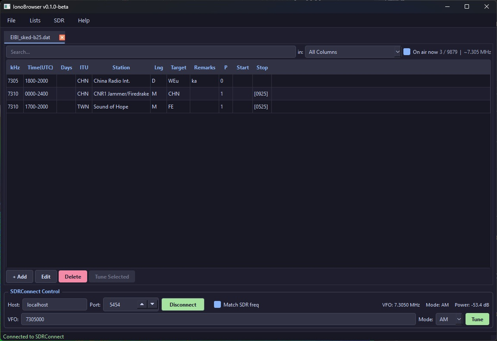
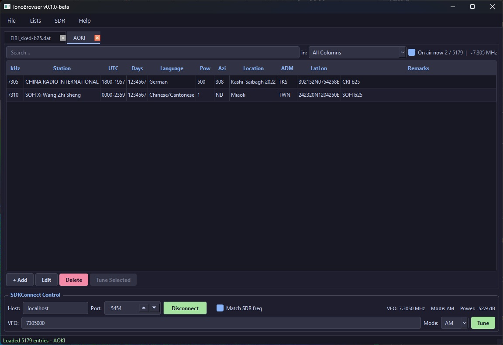

## This program was written with lots of help from the Claude AI. I understand that many people don't like applications written in this manner and I am usually the same, but I needed this quickly and this was the best way to achieve results.  


# IonoBrowser

**IonoBrowser** is a desktop application for browsing HF shortwave frequency lists and controlling an [SDRplay SDRConnect](https://www.sdrplay.com/sdrconnect/) receiver via its WebSocket API.

Open multiple frequency databases in tabs, filter by text, time-of-broadcast, or current VFO frequency, and tune your SDR with a double-click.

> **Version 0.1.0-beta** — first public release. Feedback and bug reports welcome via [GitHub Issues](https://github.com/xscode/IonoBrowser/issues).

---

## Screenshots




---

## Features

- **Multi-tab frequency list viewer** — open as many lists as you like simultaneously, each with independent filters
- **One-click download** of popular HF databases (EIBI, AOKI, HFCC, RWW, RNA, REU) with automatic format detection
- **Smart format parsing** — handles EIBI semicolon CSV, AOKI and HFCC fixed-width text, and RWW/RNA/REU quoted CSV automatically
- **On Air Now filter** — shows only stations currently broadcasting based on UTC schedule columns
- **Match SDR Freq** — filters all tabs to entries within ±5 kHz of the current SDRConnect VFO
- **SDRConnect control** — connect, tune, and change mode directly from the app via WebSocket
- **Live readback** — VFO frequency, demodulator mode, and signal power updated in real time
- **Dark and Light themes** — switchable from the Help menu, preference saved across sessions
- **Edit support** — add, edit, and delete entries in any list; save back to CSV
- **Cross-platform** — designed for Linux, macOS, and Windows _(tested on Linux; Windows/macOS testing in progress)_

---

## Supported Frequency Databases

| Source | Format | Auto-download |
|--------|--------|---------------|
| [EIBI](https://www.eibispace.de) | Semicolon-delimited CSV | ✓ |
| [AOKI](https://www1.m2.mediacat.ne.jp/binews/) | Fixed-width text (zip) | ✓ |
| [HFCC](https://www.hfcc.org) | Fixed-width text (zip) | ✓ |
| [RWW / RNA / REU](https://rxx.classaxe.com) | Quoted CSV | ✓ |
| Any custom CSV | Auto-detected | — |

Downloaded files are cached in the settings directory and available offline via **Lists → Cached Lists**.

---

## Requirements

- Python 3.10 or newer
- Dependencies are listed in `requirements.txt` and installed automatically via `pip install -r requirements.txt`:
  - [PyQt6](https://pypi.org/project/PyQt6/)
  - [websockets](https://pypi.org/project/websockets/)
  - [requests](https://pypi.org/project/requests/) _(improves download reliability)_

---

## Installation

### Option 1 — Pre-built binaries (easiest)

Download the latest release from the [Releases page](https://github.com/xscode/IonoBrowser/releases):

| Platform | File |
|----------|------|
| Linux | `IonoBrowser-x86_64.AppImage` |
| Windows | `IonoBrowser.exe` |

**Linux AppImage:**
```bash
chmod +x IonoBrowser-x86_64.AppImage
./IonoBrowser-x86_64.AppImage
```

**Windows exe:** just double-click `IonoBrowser.exe` — no installation required.

---

### Option 2 — Run from source (recommended if you prefer to inspect the code)

This is the most transparent option — you can read every line before running it.

**Linux / macOS:**
```bash
git clone https://github.com/xscode/IonoBrowser.git
cd IonoBrowser
python3 -m venv venv
source venv/bin/activate
pip install -r requirements.txt
python ionobrowser.py
```

**Windows:**
```bat
git clone https://github.com/xscode/IonoBrowser.git
cd IonoBrowser
python -m venv venv
venv\Scripts\activate
pip install -r requirements.txt
python ionobrowser.py
```

**To run again after the first install**, just activate the venv and launch:
```bash
# Linux / macOS
source venv/bin/activate
python ionobrowser.py

# Windows
venv\Scripts\activate
python ionobrowser.py
```

---

### Option 3 — Build it yourself

If you want a compiled binary but don't want to trust the pre-built one, you can build it yourself from the source.

**Windows exe** (run on Windows inside the venv):
```bat
pip install pyinstaller
pyinstaller IonoBrowser.spec
# Output: dist/IonoBrowser.exe
```

**Linux AppImage** (requires [appimage-builder](https://appimage-builder.readthedocs.io)):
```bash
pip install appimage-builder
cd appimage
APP_VERSION=0.1.0-beta appimage-builder --recipe AppImageBuilder.yml
```

> _Windows and macOS testing is ongoing — please [open an issue](https://github.com/xscode/IonoBrowser/issues) if you encounter platform-specific problems._

---

## Releases & Automated Builds

Pre-built binaries are generated automatically by GitHub Actions on every tagged release and attached to the [Releases page](https://github.com/xscode/IonoBrowser/releases).

To trigger a new release:
```bash
git tag v0.1.0-beta
git push origin v0.1.0-beta
```

GitHub Actions will then:
1. Build `IonoBrowser.exe` on a Windows runner using PyInstaller
2. Build `IonoBrowser-vX.X.X-x86_64.AppImage` on an Ubuntu runner using appimage-builder
3. Create a GitHub Release and attach both files automatically

Tags containing `beta`, `alpha`, or `rc` are automatically marked as pre-releases on GitHub.

---

## SDRConnect Setup

IonoBrowser connects to SDRConnect via its built-in WebSocket API.

1. Open SDRConnect and start a device
2. In IonoBrowser, enter the host (`localhost`) and port (`8073` by default) in the SDRConnect Control panel
3. Click **Connect**
4. Select a row in any frequency list and click **Tune Selected** (or double-click a row) to tune

The **Match SDR freq** checkbox (enabled once connected) filters all open tabs to entries within ±5 kHz of the current VFO — useful for identifying what you are listening to.

---

## Settings & Data

All settings and cached database files are stored in:

| Platform | Path |
|----------|------|
| Linux / macOS | `~/.config/IonoBrowser/` |
| Windows | `%APPDATA%\IonoBrowser\` |

Settings include window geometry, SDRConnect host/port, last open files, and theme preference.

---

## Roadmap

- [ ] Control of other SDR software (SDRUno / SDRConsole / SDR++ etc...).
- [ ] Logging of heard stations.


---

## Licence

IonoBrowser is released under the [GNU General Public License v3.0](LICENSE).

You are free to use, modify, and redistribute this software. Any derivative work must also be released under the GPL v3. Commercial sale is not permitted under the terms of this licence.

---

## Acknowledgements

- Frequency data provided by [EIBI](https://www.eibispace.de), [AOKI](https://www1.m2.mediacat.ne.jp/binews/), [HFCC](https://www.hfcc.org), and [Classaxe RXX](https://rxx.classaxe.com)
- SDRConnect WebSocket API by [SDRplay](https://www.sdrplay.com)
- UI theme inspired by [Catppuccin Mocha](https://github.com/catppuccin/catppuccin)
